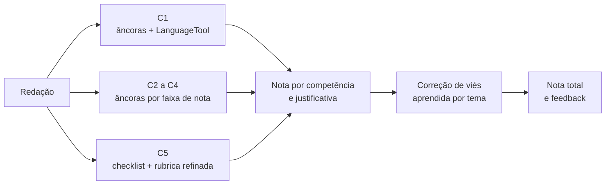
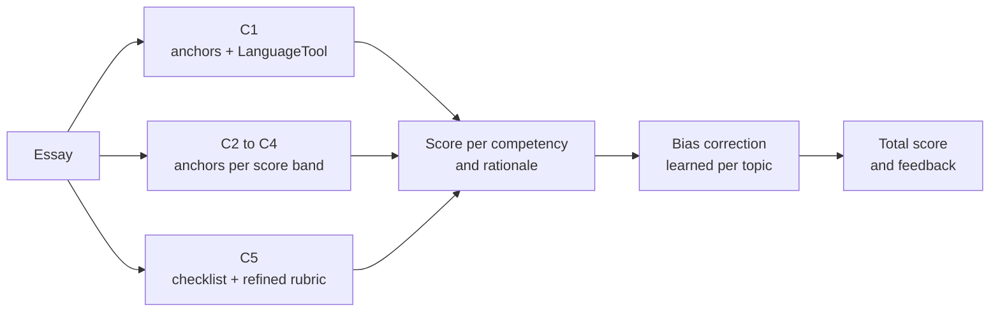

# IC Redações UTFPR

**Python · LLMs · Gemini · Qwen · Llama · Mistral · Gemma · LoRA · LanguageTool**

Correção automática de redações do ENEM com modelos de linguagem, nota por competência (C1 a C5) e geração de feedback formativo para o estudante, não só uma nota. Projeto de Iniciação Científica da UTFPR.

[Leia em inglês ↓](#english) · UTFPR · Iniciação Científica · Dataset essay-br

---

## Português

### Sobre o projeto
**Correção Automática de Redações em Português com Modelos de Linguagem Pré-Treinados e Geração de Feedback Formativo.**

O ENEM avalia a redação em cinco competências, cada uma de 0 a 200 pontos. Corrigir à mão em escala é caro e lento. A pesquisa investiga o quanto modelos de linguagem conseguem reproduzir a nota humana por competência e, principalmente, explicar ao estudante onde e como melhorar.

### Equipe
- **Orientação:** Profa. Eliane Maria De Bortoli Fávero
- **Coorientação:** Prof. Ives Rene Venturini Pola
- **Bolsistas:** Monica Paula Oliveira Mackert e Yuri Matsumoto Santos

### Dataset e avaliação
[essay-br](https://github.com/lplnufpi/essay-br), corpus público de redações argumentativas em português com nota por competência no padrão ENEM. A avaliação é cross-prompt (os temas do teste não aparecem no ajuste), e a métrica principal é o QWK (quadratic weighted kappa) na nota total. A faixa publicada para o essay-br vai de 0,60 a 0,73.

### Evolução da pesquisa
| Etapa | O que testa |
|---|---|
| v1 e v2 | Zero-shot e few-shot com modelos abertos de ~7B (Qwen 2.5, Llama 3, Mistral, Gemma 2) |
| v3 | Fine-tuning com LoRA |
| v4 | Chain-of-thought e instruction tuning para gerar feedback formativo |
| v5 e v6 | Reexecução consolidada e escala para 70B/72B (interrompida por falta de crédito de GPU) |
| v7 | Modelos hospedados gratuitos, uma chamada por competência, redações âncora, rubrica refinada e calibração de escala |

### Método atual (v7)

### Resultados (QWK na nota total)
| Configuração | QWK bruto | QWK calibrado |
|---|---|---|
| Qwen 2.5 7B, zero-shot | 0,35 | 0,35 |
| Gemma 2 9B, few-shot | 0,25 | 0,42 |
| Gemini Flash Lite, holístico | 0,47 | 0,54 |
| Gemini Flash Lite, uma chamada por competência | 0,53 | 0,60 |
| + redações âncora e checklist na C5 | 0,59 | 0,61 |
| **+ LanguageTool na C1 e rubrica refinada na C5** | **0,63** | **0,61** |

Achado principal: boa parte do QWK baixo das primeiras etapas era erro de escala, não de julgamento. Uma correção de viés simples, aprendida em temas separados, recupera a maior parte da diferença.

### Repositórios
- [CorrecaoRedacao](https://github.com/IC-Redacoes-UTFPR/CorrecaoRedacao): código, notebooks de cada etapa, resultados e o [log datado de experimentos](https://github.com/IC-Redacoes-UTFPR/CorrecaoRedacao/blob/main/docs/log_experimentos.md).

### Trabalho relacionado
- [enem-essay-classifier](https://github.com/YuriMatsumotoSantos/enem-essay-classifier): classificação de redações do ENEM em faixas de nota com aprendizado de máquina clássico e BERTimbau, trabalho da disciplina AM46S (UTFPR).

---

## English

### About the project
**Automated Essay Scoring in Portuguese with Pre-Trained Language Models and Formative Feedback Generation.**

The ENEM exam scores essays on five competencies, each from 0 to 200. Grading by hand at scale is slow and expensive. This research investigates how well language models can reproduce the human score per competency and, above all, explain to the student where and how to improve. Undergraduate research project at UTFPR (Federal University of Technology, Paraná, Brazil).

### Team
- **Advisor:** Prof. Eliane Maria De Bortoli Fávero
- **Co-advisor:** Prof. Ives Rene Venturini Pola
- **Research fellows:** Monica Paula Oliveira Mackert and Yuri Matsumoto Santos

### Dataset and evaluation
[essay-br](https://github.com/lplnufpi/essay-br), a public corpus of argumentative essays in Portuguese scored per competency following the ENEM standard. Evaluation is cross-prompt (test topics are unseen during tuning) and the main metric is QWK (quadratic weighted kappa) on the total score. Published results for essay-br range from 0.60 to 0.73.

### Research timeline
| Stage | What it tests |
|---|---|
| v1 and v2 | Zero-shot and few-shot with ~7B open models (Qwen 2.5, Llama 3, Mistral, Gemma 2) |
| v3 | LoRA fine-tuning |
| v4 | Chain-of-thought and instruction tuning to generate formative feedback |
| v5 and v6 | Consolidated rerun and scaling to 70B/72B (stopped for lack of GPU credit) |
| v7 | Free hosted models, one call per competency, anchor essays, refined rubric and scale calibration |

### Current method (v7)

### Results (QWK on the total score)
| Configuration | Raw QWK | Calibrated QWK |
|---|---|---|
| Qwen 2.5 7B, zero-shot | 0.35 | 0.35 |
| Gemma 2 9B, few-shot | 0.25 | 0.42 |
| Gemini Flash Lite, holistic | 0.47 | 0.54 |
| Gemini Flash Lite, one call per competency | 0.53 | 0.60 |
| + anchor essays and C5 checklist | 0.59 | 0.61 |
| **+ LanguageTool on C1 and refined C5 rubric** | **0.63** | **0.61** |

Main finding: much of the low QWK in the early stages was a scale error, not a judgment error. A simple bias correction, learned on held-out topics, recovers most of the gap.

### Repositories
- [CorrecaoRedacao](https://github.com/IC-Redacoes-UTFPR/CorrecaoRedacao): code, notebooks for each stage, results and the [dated experiment log](https://github.com/IC-Redacoes-UTFPR/CorrecaoRedacao/blob/main/docs/log_experimentos.md).

### Related work
- [enem-essay-classifier](https://github.com/YuriMatsumotoSantos/enem-essay-classifier): ENEM essay score band classification with classical machine learning and BERTimbau, a project for the AM46S Machine Learning course (UTFPR).
